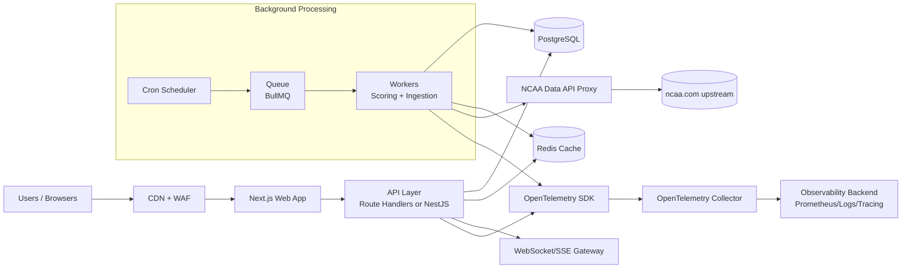

Today began work on making fantasy-hoops revamped. Decided to make the backed in supabase using edge functions for backend tasks like scoring.

I started by making the backend database tables. The schemas have been added to the repos as well as a typescript function for calculating scores. The edge function was added to the supabase portal and the base url and uri have been added as configs so that the front end can access them. 

Below is a ChatGPT Deep Research write up with a few different architecture suggestions. 

# Remaking bowenaidan/fantasy-hoops as a Full-Service Web App

## Executive summary

The current **bowenaidan/fantasy-hoops** project is best understood as a **Google Apps Script + Google Sheets**-hosted fantasy game: it computes scores using NCAA game results and rankings retrieved from a third-party “NCAA API” proxy and stores all league state in spreadsheet tabs, with a lightweight HTML UI served through Apps Script’s HTML Service (via `doGet()` + HTML output and client calls back to server functions). Apps Script’s model—returning sanitized HTML via `HtmlService`/`HtmlOutput` and using `google.script.run` for asynchronous client-to-server calls—maps cleanly to modern web app patterns (SSR/SPA + JSON APIs), but it constrains scalability, observability, and secure multi-user access control. citeturn0search2turn0search1turn0search5turn0search4

The most critical external dependency is the upstream data source. The repo uses the **henrygd/ncaa-api** service (a proxy to ncaa.com paths) for scoreboard and rankings data; its documentation is explicit that the public demo endpoint is **rate-limited (~5 rps / IP)** and recommends self-hosting if you need reliability long-term. citeturn12search0

A full-service web app remake should therefore prioritize: (a) **a durable relational data model** for season/league history, auditability, and analytics; (b) **a reliable ingestion pipeline** that normalizes NCAA data and computes fantasy scoring deterministically and idempotently; (c) **secure, tenant-aware authorization** (teams/managers/leagues) aligned with common web security risk categories (access control, auth failures, logging/monitoring). citeturn25search0turn15search3turn26search3

Recommended direction (given no constraints provided): build a **modular monolith** with a typed API and a job system—**React + Next.js** for UI and server endpoints, **PostgreSQL** as the system of record, **Redis + BullMQ** (or Celery in the Python option) for background jobs, plus scheduled jobs (Vercel Cron Jobs or Cloudflare Workers Cron Triggers depending on hosting) for periodic NCAA sync. This matches the existing “scheduled sync + standings table + live scores view” product while unlocking production-grade auth, observability, and scaling. citeturn15search7turn15search2turn24search2turn18search3turn29search3turn28search0

## Repo-based product decomposition

### What the repo does today

From inspection of the repository files and README, the current application implements the following core feature set:

- **Daily score sync and standings updates**: a “daily sync” routine fetches NCAA men’s D1 scoreboard data for a given date and computes fantasy points per rostered team based on configurable conference tier rules and opponent ranking adjustments (e.g., bonus for beating ranked teams). The results increment “points today” and settle into cumulative “points” in the TEAMS sheet.
- **Opponent + “potential points” enrichment**: a routine updates each rostered team’s current opponent, opponent rank, opponent conference, and computes “potential points” for the day’s game so the UI can show what a team is “playing for” today.
- **Rank sync**: an AP poll fetcher updates internal “rank” values for teams, which then influences scoring.
- **Simple web UI**: an Apps Script HTML Service page that displays (a) teams grouped by manager, (b) search by team, and (c) live scores; it loads data by calling a server-side function (`google.script.run.withSuccessHandler(...).getTeamsPageData()`), which reads from the TEAMS and LIVE_SCORES sheets. Apps Script HTML serving and the client-to-server call mechanism are standard patterns documented by Google. citeturn0search5turn0search2turn0search4

### Inferred data model in the spreadsheet

Although the backing store is Google Sheets, the repo implies these “tables” (sheet tabs) and their logical records:

- **TEAMS**: rostered NCAA teams with columns such as `team`, `manager`, `rank`, `points`, `points_today`, and “today context” fields like `opponent`, `opponent_rank`, `opponent_conference`, `home_game`, `potential_points`.
- **LIVE_SCORES**: per-game rows containing game identifiers and the current/last known home/away team names, ranks, scores, and clock/period.
- **BUY_GAME_LOSSES**: manual adjustments (a table of team + points deltas) applied back into standings.
- **DRAFT / Point Structure**: season-specific configuration and draft info.

This strongly suggests a relational database schema is the natural target (Leagues → Seasons → Managers → Teams/Rosters → Games → ScoringEvents/StandingsSnapshots), with deterministic scoring jobs that update materialized standings.

### External APIs and third-party integrations

The repo’s scoring logic depends on the **henrygd NCAA API** proxy service:

- Its usage model is “make a GET request using the same path as the URL on ncaa.com” and receive JSON. citeturn12search0  
- It exposes endpoints for **Scoreboard** (live scores for sport/division/date), **Schedule**, **Game details**, and **Rankings**, and provides an OpenAPI explorer. citeturn12search0  
- The public instance is **rate-limited** and the maintainer recommends self-hosting for reliability. citeturn12search0  
- The upstream project documents simple container deployment (Docker and docker-compose). citeturn12search0turn23search2turn23search1

The other major integration is Google Apps Script itself (HTML Service + `google.script.run`), which is a deployment/runtime choice to be replaced in a full-service rebuild. citeturn0search5turn0search4

### Deployment scripts in the repo

There are **no explicit CI/CD or infrastructure scripts** in the fantasy-hoops repo itself (no workflows, IaC, or app manifest visible via connector inspection). Instead, the “deployment” is implicitly “copy Apps Script files into a Google Sheet-bound Apps Script project,” which is consistent with Apps Script’s hosting model. For the external NCAA API proxy, container-based deployment is documented by its upstream project. citeturn12search0turn23search2

## Architecture options

The options below are deliberately “full-stack” end-states that preserve today’s behavior (standing updates + live scores + ranks + manager/team views) while adding production requirements: authentication, authorization, multi-league support, auditability, observability, and safer background processing.

### JAMstack with managed backend and serverless jobs

**Representative stack**:  
Frontend: Next.js (React) deployed on a CDN/edge platform; Backend: Supabase (Postgres + Auth + RLS) and Edge Functions; Background/scheduled jobs: Vercel Cron Jobs (if deploying on Vercel) or Cloudflare Workers Cron Triggers; Optional queue: managed Redis + BullMQ (only if needed beyond cron). citeturn15search7turn15search2turn15search0turn29search1turn29search3turn28search0

**Rationale**  
This is the fastest path to “working product” with strong defaults: managed Postgres, built-in auth, and database-enforced authorization via RLS. Supabase explicitly positions RLS as “defense in depth” and recommends enabling it for exposed schemas. citeturn15search0turn14search1

**Pros**  
Operational overhead is low (managed DB, managed auth, minimal servers); the data model is relational and queryable; RLS can enforce tenant isolation at the database layer. citeturn15search0turn14search1

**Cons**  
Complex scoring pipelines can outgrow “cron + edge function” patterns; heavy ingestion may require a queue/worker anyway. Edge/serverless Postgres connectivity has architectural constraints (connection limits) that you must design for (pooling/proxy). Supabase Edge Functions run on a Deno-compatible runtime and involve a gateway that may apply auth/policy checks. citeturn29search1

**Scalability and cost profile**  
Generally strong for read-heavy workloads (CDN, cached pages). Costs are usually predictable early but can increase with high-frequency cron polls and realtime updates. **Effort**: Low–Medium. **Relative cost**: Low–Medium.

**Security considerations**  
Use OAuth/OIDC-based login for managers/admins; enforce RLS policies for multi-tenant leagues. OAuth 2.0 and OIDC are standard foundations for delegated authorization and identity; PKCE is a mitigation for code interception for public clients. citeturn25search2turn26search3turn27search9turn15search0  
Align controls with OWASP Top 10 categories (broken access control, auth failures, logging/monitoring). citeturn25search0

### Containerized modular monolith with typed API and job workers

**Representative stack**:  
Frontend: Next.js (React) for UI, plus Route Handlers for API endpoints; Backend: NestJS (TypeScript) as an internal API/service layer (optional but recommended if the API grows); DB: PostgreSQL; Cache/queue: Redis + BullMQ; Real-time: WebSockets (native or via Socket.IO) for live scores; CI/CD: GitHub Actions; Deploy: containers on AWS ECS/Fargate, Fly.io, Render, GCP Cloud Run, etc. citeturn15search2turn15search6turn18search3turn23search2turn16search0turn20search0turn25search0

**Rationale**  
This option maps best to the repo’s underlying behavior: a persistent store + scheduled ingestion + deterministic scoring. It also ensures you can self-host dependencies (including the NCAA proxy if desired) to avoid rate-limit reliability issues. The NCAA API project explicitly notes rate limits on the public instance and recommends self-hosting for long-term reliability. citeturn12search0

**Pros**  
Strong control of ingestion and scoring correctness; clean separation of concerns (UI vs API vs workers); straightforward horizontal scaling (add more worker replicas, scale API separately); easier to add advanced features (audit logs, scoring replay, multi-season history). BullMQ is explicitly designed as a Redis-backed queue with scalability properties and “exactly once” intent (at-least-once in worst case) and supports retries and repeatable cron-style jobs. citeturn18search3turn18search4

**Cons**  
Higher operational complexity than fully managed serverless; requires container build/deploy and careful secrets management. Dockerfile and Compose references define the baseline for containerizing services, but you still need a platform and ops discipline. citeturn23search2turn23search1

**Scalability and cost profile**  
Scales well via stateless API + scalable workers + managed Postgres/Redis. Costs are moderate and can be optimized by right-sizing. **Effort**: Medium–High. **Relative cost**: Medium.

**Security considerations**  
Implement OAuth/OIDC login for managers/admins (OAuth 2.0 and OIDC are the core specs). citeturn25search2turn26search3  
Treat all mutations (Route Handlers / server actions) like public API endpoints with explicit authorization checks—as Next.js guidance recommends. citeturn15search3turn15search2  
Use Postgres row-level security as an additional layer if you expose data directly from the DB to clients (or to enforce strict tenant rules internally). citeturn14search1  
Follow OWASP Top 10 emphasis on broken access control, auth failures, and security logging & monitoring. citeturn25search0

### Django monolith with background workers and real-time add-ons

**Representative stack**:  
Backend: Django + Django REST Framework; DB: PostgreSQL; Background jobs: Celery + Redis (broker) + Celery Beat (scheduler); Real-time: Django Channels (WebSockets) or SSE; Frontend: Django templates for MVP or separate React app as the UI grows; CI/CD: GitHub Actions; Deploy: containerized or PaaS. citeturn17search1turn19search8turn19search3turn16search0turn20search0

**Rationale**  
Django gives you a mature admin interface and a built-in authentication system (users, groups, permissions, sessions) that maps closely to “league admins vs managers vs viewers.” citeturn17search1

**Pros**  
Fast to build business CRUD and admin workflows; stable ORM and migration workflow (schema as code; consistent migrations across environments). citeturn17search9  
Celery is a standard approach to periodic + asynchronous tasks; Celery Beat is explicitly the scheduler for kicking off tasks at intervals, and Celery documents Redis broker configuration. citeturn19search0turn19search8

**Cons**  
If you want a highly interactive UI, you may still build a separate SPA/SSR frontend. Introducing Channels adds complexity. Python performance is typically “good enough,” but very high throughput might call for more tuning.

**Scalability and cost profile**  
Scales well with proper separation (web dynos + worker dynos + DB/Redis). **Effort**: Medium. **Relative cost**: Medium.

**Security considerations**  
Leverage Django’s built-in auth primitives (users, permissions, groups, sessions). citeturn17search1  
Use OWASP Top 10 as a checklist and ensure adequate logging/monitoring coverage. citeturn25search0

## Technology recommendations

This section recommends concrete technologies for a robust rebuild, with a bias toward maintainability and correctness of scoring.

### Core product choices

**Frontend**: React + Next.js (App Router)  
Next.js provides the routing and server integration you need for a full-stack experience (Route Handlers, server-side rendering, and server-side functions). Route Handlers are the modern equivalent of API routes in the App Router and support standard HTTP methods. citeturn15search7turn15search2turn15search4  
React remains the UI foundation. citeturn15search5

**Backend API layer** (two viable patterns):

- “API inside Next.js” (MVP-friendly): Use Next.js Route Handlers for REST endpoints (e.g., `/api/standings`, `/api/scores/live`). citeturn15search2  
- “Service layer” (recommended for v1): Add NestJS as a modular, dependency-injected backend for the scoring and league domain. NestJS modules organize controllers/providers and make boundaries explicit. citeturn15search6

**Database**: PostgreSQL as system of record  
Postgres supports structured relationships (leagues, managers, rosters, games), plus opportunistic JSON storage for raw upstream payloads. Postgres documentation highlights that `jsonb` is generally faster to process and supports indexing, making it a good type for storing raw NCAA JSON snapshots for replay/forensics. citeturn24search0turn24search3

**Caching and job queue**: Redis + BullMQ (TypeScript stack)  
BullMQ is explicitly a robust Redis-backed queue system designed for horizontal scaling, retries, delayed jobs, and repeatable schedules. citeturn18search3turn18search4turn18search6  
(If you choose Django: Redis + Celery, with Celery Beat for periodic sync tasks and Redis as broker.) citeturn19search0turn19search8

**Real-time live scores**: WebSockets (plus fallback)  
WebSockets allow two-way interactive sessions without polling. citeturn20search0  
Recommendation: implement **Server-Sent Events (SSE)** as a “simple baseline” for live-score streams if you don’t need bi-directional messaging; use WebSockets when you need true bi-directional interactions (chat, commissioner tools, live drafts). (WebSockets are still fine for the initial scope.)

### Authentication and authorization

**Auth standard**: OAuth 2.0 + OpenID Connect (OIDC)  
OAuth 2.0 defines delegated authorization using access tokens. citeturn25search2  
OIDC adds a standardized identity layer on top of OAuth 2.0. citeturn26search3  
For public clients and modern best practices, **PKCE** mitigates authorization code interception threats. citeturn27search9

**App-layer authorization**: role- and league-aware  
Use structured roles (e.g., `admin`, `commissioner`, `manager`, `viewer`) and enforce permission checks at the API boundary. Next.js guidance explicitly recommends treating Route Handlers and Server Actions with the same security considerations as public API endpoints and verifying authorization for each request. citeturn15search3turn15search2

**Defense-in-depth option**: Postgres RLS  
If exposing database queries directly to the browser (Supabase-style), enforce Row Level Security; Postgres documents that RLS restricts which rows can be selected/modified and defaults to deny without policies. citeturn14search1turn15search0

### Observability and operations

**Telemetry standard**: OpenTelemetry (OTel)  
OpenTelemetry is a vendor-neutral framework for generating and exporting traces/metrics/logs. Use the OpenTelemetry Collector to receive, process, and export telemetry data. citeturn21search1turn21search0

**Metrics backend**: Prometheus (optional self-host)  
Prometheus’s configuration model (“scrape configs” define targets and scrape parameters) is well-suited to container/PaaS environments. citeturn22search1turn22search0

**CI/CD**: GitHub Actions  
GitHub Actions is designed for automating CI/CD workflows in-repo; workflows are YAML files with jobs and triggers. citeturn16search0turn16search1

**Containerization**: Docker (+ optional Compose for local dev)  
Docker’s Dockerfile is the standard build spec for images, and Docker Docs describe the supported instructions. citeturn23search2  
For local multi-service dev, Docker Compose uses the Compose specification to define services/networks/volumes. citeturn23search1

**Orchestration** (optional): Kubernetes  
If you expect multiple services and high scale, Kubernetes Ingress can route external HTTP(S) traffic—but Kubernetes now recommends Gateway for newer use cases, and Ingress API changes are frozen. citeturn24search2

### Data ingestion strategy for NCAA data

Because the public NCAA API endpoint is rate-limited and recommended for demo/testing, architect around one of these:

- **Preferred for reliability**: self-host the NCAA API proxy (dockerized) and treat it as an internal dependency, caching upstream results. citeturn12search0turn23search2  
- **If staying on the public endpoint initially**: implement strong caching, strict request budgets, and backoff; poll less frequently and push updates to clients via real-time channels.

## Migration and implementation roadmap

The roadmap assumes you rebuild as a standalone web app (not Apps Script) and you want an MVP quickly while leaving room for v1 hardening. Timelines are approximate and depend on team size and quality bar.

### MVP scope and milestones

**Milestone: Product spec and scoring contract** (about 1 week)  
Deliverables: formal scoring rules document (conference tiers, ranking bonuses, penalties), authoritative list normalization rules, and a small suite of “golden test fixtures” (example games → expected points). This is critical because your scoring is the “business logic” and must be deterministic and replayable.

**Milestone: Data model and ingestion skeleton** (about 1–2 weeks)  
Deliverables: Postgres schema + migrations; NCAA ingestion job that pulls scoreboard and rankings on-demand; raw payload storage in `jsonb` for debugging/replay (Postgres `jsonb` is generally faster and indexable vs `json`). citeturn24search0turn24search3

**Milestone: Standings and teams UI** (about 1–2 weeks)  
Deliverables: Next.js app with “standings” and “teams by manager” views; Route Handlers for `GET /api/standings` and `GET /api/teams`. Route Handlers are Next’s modern request handler mechanism in the App Router. citeturn15search2turn15search4

**Milestone: Auth + multi-tenant leagues** (about 1 week)  
Deliverables: OAuth/OIDC login; role model (admin/commissioner/manager); tenant isolation (league membership) at the API layer, plus optional DB-layer RLS if you plan to expose queries directly. citeturn25search2turn26search3turn14search1

**MVP target**: ~5–7 weeks total  
MVP definition: authenticated managers can view standings, search teams, see today’s opponents/potential points, and view live scores (polling or basic SSE). Admin can configure league rosters and scoring settings.

### v1 scope and milestones

**Milestone: Background workers and reliable scheduling** (about 1–2 weeks)  
Deliverables: job queue + workers (BullMQ preferred for TypeScript; Celery if Python) and scheduled execution. BullMQ supports repeatable jobs; Celery Beat is the periodic scheduler and Redis is a documented broker option. citeturn18search3turn19search0turn19search8  
Scheduling options:
- Vercel Cron Jobs (cron definitions in `vercel.json`, production-only invocation; includes guidance for securing invocations). citeturn29search3turn29search6  
- Cloudflare Workers Cron Triggers (cron mapped to a Worker `scheduled()` handler). citeturn28search0  

**Milestone: Real-time upgrades** (about 1 week)  
Deliverables: WebSocket-based “live scores” channel and server-side throttling; MDN documents WebSockets as enabling two-way interactive communication without polling. citeturn20search0

**Milestone: Observability + security hardening** (about 1–2 weeks)  
Deliverables: OpenTelemetry instrumentation (traces/metrics/logs) and a Collector deployment; OpenTelemetry is vendor-neutral and the Collector is the standard “receive/process/export” component. citeturn21search1turn21search0  
Add security guardrails aligned to OWASP Top 10 categories, especially access control and logging/monitoring. citeturn25search0

**v1 target**: ~8–12 weeks total (including MVP work)  
v1 definition: multi-league support with commissioner tools, reliable scheduled updates, replayable scoring, metrics/alerts, and production-ready auth.

## Deployment blueprint and option comparison

### Sample deployment architecture diagram

Notes on referenced components:
- NCAA proxy behavior and rate limits are documented by the upstream project (including an OpenAPI explorer and docker deployment). citeturn12search0turn23search2  
- OpenTelemetry and its Collector are documented as the vendor-neutral standard for telemetry collection and export. citeturn21search1turn21search0

### Comparison table across architecture options

| Attribute | JAMstack + Supabase | Modular monolith (Next.js + NestJS) | Django monolith |
|---|---|---|---|
| Performance | Strong for cached reads; depends on serverless limits | Strong; can tune API + workers independently | Strong enough for most; tuning needed at high scale |
| Dev speed | Fast for MVP (managed auth + DB) | Medium (more infra/code) | Medium–fast (admin + ORM accelerates CRUD) |
| Cost profile | Low–medium early; may grow with function invocations | Medium; predictable with right-sizing | Medium; predictable with right-sizing |
| Scalability | Good; may need queue/worker as ingestion grows | Excellent for ingestion-heavy + compute-heavy scoring | Good; common scale-out pattern with workers |
| Complexity | Low–medium | Medium–high | Medium |
| Real-time | Supabase realtime or custom channels | WebSockets/SSE straightforward | Channels/SSE; adds moving parts |
| Best fit | “Get it live fast” + small ops | “Most like a production platform” | “Admin-heavy, Python-friendly” |

### Chart of relative tradeoffs

The chart below is a **subjective relative estimate** (1–5) of development effort, operational complexity, and cost profile across the three options. It is intended as a discussion aid, not a prediction.

## Prioritized integration points and missing pieces

### Integration points carried forward from the repo

**Highest priority**

- **Scoreboard data ingestion**: the repo depends on the NCAA API proxy’s scoreboard route; upstream docs describe scoreboard as returning live scores for sport/division/date and recommend self-hosting for reliability. citeturn12search0  
- **Rankings ingestion**: the repo uses rankings (AP poll) via the same NCAA proxy; upstream docs include rankings among “works with scores, stats, rankings…” and provide an OpenAPI explorer. citeturn12search0  
- **Scheduling**: Apps Script time-based triggers map to web-platform schedulers like Vercel Cron Jobs or Cloudflare Workers Cron Triggers. citeturn29search3turn28search0

**Medium priority**

- **Self-hosting the NCAA proxy** (if reliability is required): upstream provides docker deployment instructions, enabling you to internalize rate limiting and availability. citeturn12search0turn23search2  
- **Queue-backed ingestion/scoring**: BullMQ provides a Redis-backed queue with retries and repeatable jobs; it is designed for horizontal scaling. citeturn18search3turn18search4

### Missing pieces to implement in a full-service web app

**Product and UX**

- League lifecycle: create league, invite managers, manage draft/rosters, lock rules per season, publish standings history.
- Team pages and analytics: game-by-game scoring breakdown (“why did I get +5 today?”), audit log, replay scoring.

**Backend correctness and resilience**

- Idempotency + replay: ingest upstream games, store raw payloads (prefer `jsonb` for query/index), compute scoring events deterministically, and support re-running scoring when rules change. citeturn24search0  
- Rate limiting and caching: especially if using the public NCAA API endpoint (5 rps / IP) or if you choose not to self-host immediately. citeturn12search0

**Security**

- Authentication + authorization: use OAuth 2.0 + OIDC for identity; apply PKCE where applicable. citeturn25search2turn26search3turn27search9  
- Access control hardening aligned with OWASP Top 10 (broken access control, identification/auth failures, logging/monitoring). citeturn25search0  
- Secure scheduled endpoints: if using platform cron (e.g., Vercel), secure cron invocations (Vercel supports a `CRON_SECRET` env var for securing cron jobs). citeturn29search6

**Observability**

- Implement OpenTelemetry instrumentation and run an OpenTelemetry Collector for standardized telemetry export. citeturn21search1turn21search0  
- Metrics scraping/collection strategy (Prometheus scrape configs or managed observability). citeturn22search1turn22search0

**Dev tooling**

- CI/CD via GitHub Actions workflows (tests, lint, build, deploy). citeturn16search0turn16search1  
- Containerized local dev environment (Dockerfile + Compose). citeturn23search2turn23search1